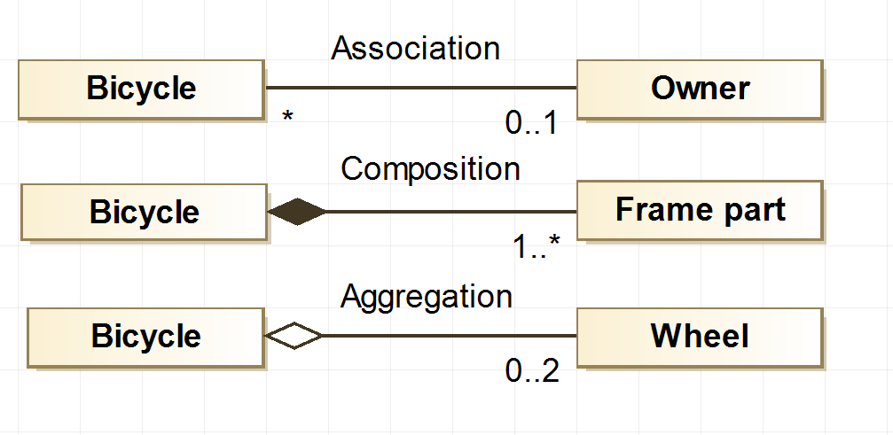

 # Association , Aggregation , Object composition

 ## Association
 - An association is a relationship between two or more objects in which the objects have their own lifetime and there is no owner.
 ## Aggregation 
 - a relation that exists between two or more two objects which individually have their own individual life cycle along with the ownership
 ## Object composition
 - describes a class that refers to one or more objects of the other class instance variables
 